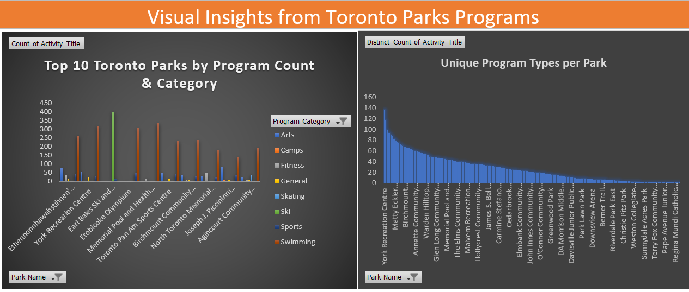

# Toronto_Parks_Program_Analysis

## Project Overview
This project analyzes recreational programs offered across Toronto parks. The goal is to understand:

- Total number of program sessions per park  
- Variety of programs offered at each park  
- Distribution of program categories across parks  

The analysis was performed in **Microsoft Excel** using features such as **VLOOKUP, Pivot Tables, Distinct Count, and charts** to provide actionable insights.

---

## Data Description
The Excel file contains the following sheets:

- **Registered Programs** – Contains all program registration records, including Activity Title, Program Category, Date, Location ID, and the **merged Park Name**.  
- **Locations** – Contains Location ID, Park Name, and addresses.
 
---

## Data Cleaning Steps
1. Added Park Name from the **Locations** sheet to **Registered_Programs** using VLOOKUP.  
2. Trimmed spaces from IDs and text to ensure correct matching.  
3. Removed duplicate rows and empty rows.  
4. Ensured consistent column headers for Pivot Table usage.  

---

## Analysis Performed
- **Pivot Tables**:
  - Count of Activity Title → Shows total program sessions per park.
  - Distinct Count of Activity Title → Shows number of unique programs per park.

- **Charts**:
  - Column charts showing total program sessions per park.  
  - Column charts showing unique program types per park.  

- **Insights** extracted from charts and Pivot Tables.

---

## Key Insights
• Ethennonnhawahstihnen' Community Recreation Centre and Library has the highest number of program sessions.
• York Recreation Centre offers highest unique programs.
• Earl Bales Ski and Snowboard Centre is the only park offering Ski programs.
• Swimming programs dominate across most parks.

---

## Tools Used
- Microsoft Excel (Pivot Tables, Charts, VLOOKUP)
 
---

## How to Use
1. Open `Toronto_Parks_Analysis.xlsx`.  
2. Navigate to the **Dashboard** sheet to view charts and key insights.  
3. Explore Pivot Tables on separate sheets for detailed analysis.  

---

## Project Outcome
This project demonstrates the ability to:  

- Clean and merge datasets using Excel functions  
- Aggregate and analyze data with Pivot Tables  
- Visualize program distribution and variety across multiple locations  
- Extract actionable insights from large datasets  

---

